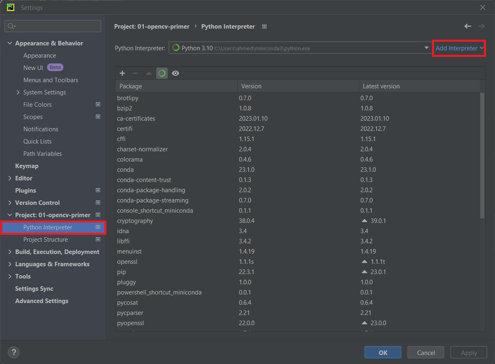
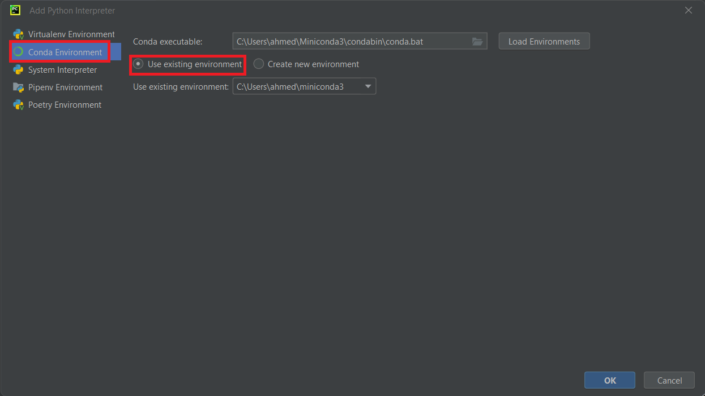

#  Deep Learning for Computer Vision

## Getting Started

```bash
git clone https://github.com/ahosnyyy/cv-iti.git
cd cv-iti
```

### Conda
If you don't have Anaconda installed I recommend downloading [miniconda](https://docs.conda.io/en/latest/miniconda.html).
```bash
conda env create -f conda-env.yml
conda activate cv-env
```

### Setting up PyCharm with Anaconda interpreter
Download and Install [PyCharm community](https://www.jetbrains.com/pycharm/download/).

1.  Open the relevant project.
2.  Press "Ctrl + Alt + S" to open the Settings screen.
3.  Select Project: XXXXXXX> Python Interpreter from the left pane.


4.  Select "Add Interpreter> Add Local Interpreter" on the Project Interpreter screen.


5. When the Add Python Interpreter screen is displayed, choose Conda Environment from the left pane.
6. Check "Existing environment" and select the Anaconda environment you created earlier.
7. When the "Settings" screen appears, select the Activated "Apply" button. This will change the interpreter and package used in the project to the same settings as Anaconda.